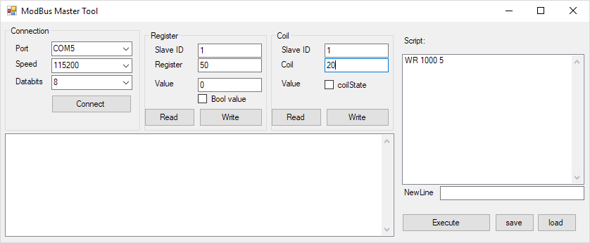

 

Simple ModBus Master tool with scripting capabilities. 

Scripting:
You have five commands available: 

WR: Write Register

Usage: WR Register Value

RR: Read Register

Usage: RR Register

WC: Write Coil

Usage: WC Register Value 

RC: Read Coil 

Usage: RC Register

PC: Poll "Coil". This Command polls specific bits from a register.  

Usage: PC Register Bitmask (dec)

